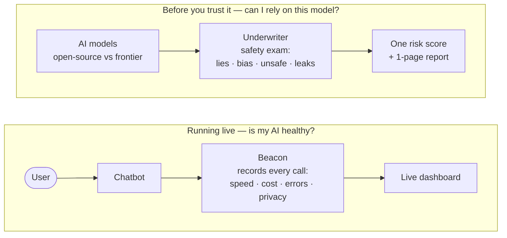

# Ollive Platform — Observe Every Call, Score Every Model

## TL;DR

Any company building on AI has to answer two practical questions. This project
answers both — and ships a working chatbot to prove it.

1. **"Is my AI healthy right now?"** → **Beacon** is a flight recorder for AI.
   Every time the chatbot talks to a model, Beacon notes how fast it was, what it
   cost, whether it failed, and strips out personal data — then shows it all on a
   live dashboard. You can't run AI in production blind; this is the instrument panel.

2. **"Can I trust this model in the first place?"** → **Underwriter** is a safety
   inspector. It gives a cheap open-source model and an expensive frontier model
   the same exam — does it make things up, show bias, follow dangerous
   instructions, or leak secrets? — and turns the answers into one risk score and
   a one-page report.



*Two independent flows. They don't pass requests to each other — they just share
the same underlying code (model routing + cost math).*

**Why two halves?** Beacon watches AI *while it runs*; Underwriter judges a model
*before you trust it*. Together they cover the whole lifecycle: pick a safe model,
then keep it honest in production. They share one codebase — the chatbot, the
model plumbing, and the cost math are written once and used by both.

### What's in the box

| Part | In plain words | Why it exists |
|---|---|---|
| **Chatbot + web app** | The app you actually talk to (`web/`) | Gives us something real to observe and evaluate, not a toy demo |
| **Beacon** | A flight recorder for every AI call (`llmobs/`, `beacon/`) | See speed, cost, and errors live; never lose a conversation; keep private data out of the logs |
| **Underwriter** | A safety inspector that scores models (`underwriter/`) | Know how risky a model is *before* trusting it with real users |
| **Shared core** | The common plumbing both halves reuse (`core/`) | Model routing and cost math written once, so nothing is built twice |
| **Deploy** | One-command startup + cloud configs (`deploy/`) | Anyone can run the whole thing with a single command |

The rest of this page explains each half in more detail.

---

## Beacon — watch every LLM call

A streaming, multi-provider chatbot wired into an observability pipeline. The
chatbot is the workload; the pipeline is the point — it captures what every
inference did and stores it for analysis without ever blocking the chat.

**SDK (`llmobs`)** — non-blocking capture at the call site. Every inference is
wrapped in a `trace()` span that records model, provider, latency, TTFT, tokens,
cost, status, and PII-redacted previews. The span `emit()`s onto a bounded
in-memory queue and returns immediately — the model stream is never delayed by
observability.

**Gateway (FastAPI `:8000`)** — SSE streaming chat over `POST /chat`. Supports
multi-turn conversations, cancel-mid-stream, conversation resume, and multi-provider
routing (GPT-4.1, Claude, Gemini, DeepSeek, Grok — all via one OpenRouter key).

**Ingestion API (FastAPI `:8088`)** — receives SDK events, validates them,
publishes to Redpanda keyed by `request_id`, returns 202 immediately. Malformed
payloads go to a DLQ topic rather than failing the batch.

**Worker** — Kafka consumer that writes to Postgres with
`INSERT … ON CONFLICT (request_id) DO NOTHING`. Idempotent by design; redelivery
is a no-op. Commits the offset only after the DB write (at-least-once delivery).

**React SPA (`:5173`)** — Chat with streaming tokens, conversation list/resume/cancel,
Observability dashboard (p50/p95/p99 latency, throughput, error rate, cost by model),
and trace waterfall per conversation (TTFT bar, token counts, PII redaction badges).

**Infrastructure** — One-command `docker compose up --build` brings up all nine
services. Kubernetes manifests (kustomize) provided for production deployment.
Prometheus metrics on gateway and ingestion; structured JSON logging throughout.

### Architecture

```
Browser (React/Vite)
  │  POST /chat → SSE stream
  ▼
Gateway (FastAPI :8000)
  │  llmobs SDK wraps every LLM call — non-blocking, PII-redacted
  │  OpenRouter → GPT-4.1 | Claude | Gemini | DeepSeek | Grok
  ▼
Ingestion API (FastAPI :8088)
  │  validate → 202  |  malformed → DLQ
  ▼
Redpanda (Kafka API)          key = request_id  →  idempotent
  ▼
Worker
  │  INSERT … ON CONFLICT (request_id) DO NOTHING
  ▼
Postgres
  ├── conversations + messages   (written synchronously by gateway)
  └── inference_logs             (written async by worker)
```

### Key design decisions

**Two write paths by guarantee.** Chat state (`conversations`, `messages`) is
written synchronously by the gateway — it must be exact for resume/cancel.
Observability (`inference_logs`) flows the async pipeline and is best-effort;
losing a log never corrupts a chat.

**Capture at the call site, never on the critical path.** The SDK only enqueues;
a daemon thread does the I/O. The model's blocking stream runs in a worker thread
bridged to asyncio, so one slow generation can't stall the event loop.

**Redact before egress.** PII (emails, phones, SSNs, card numbers) is scrubbed
in-process before anything is buffered or transmitted. Only redacted, truncated
previews are stored, plus a `redaction_counts` receipt proving the control fired.

**At-least-once + idempotency.** Every event carries a `request_id` threaded from
the SDK through Kafka to Postgres. The `UNIQUE` constraint + `ON CONFLICT DO NOTHING`
make re-delivery a no-op.

**Logging degrades gracefully, never fails.** SDK failures follow: retry with
exponential backoff + jitter → circuit breaker opens after N consecutive failures
→ drop-with-counter once the bounded queue overflows. Every drop is counted so
loss is observable, not silent.

### Schema design tradeoffs

| Decision | Tradeoff |
|---|---|
| Two write paths (sync chat + async observability) | Correctness for chat state; best-effort for logs. Clear contract: observability loss never corrupts conversation |
| `request_id` UNIQUE as idempotency key | Safe redelivery from Kafka; slight write overhead on every insert |
| Previews not raw content in inference_logs | Privacy-by-design; full content only in `messages` (the chat record) |
| JSONB for `meta` and `redaction_counts` | Absorbs provider-specific fields without schema migrations |
| Postgres for both OLTP and analytics | Simple at current volume; documented scale-out path to ClickHouse via the same Kafka topic |

### Quickstart

```bash
cp .env.example .env          # add OPENROUTER_API_KEY
docker compose -f deploy/docker-compose.yml up --build
# → http://localhost:5173
```

### What I'd improve with more time

- **ClickHouse analytics** — swap `percentile_cont` Postgres queries for a
  ClickHouse MergeTree fed by the same Redpanda topic. Same read API, no client
  changes, real high-volume percentiles.
- **True stream cancellation** — abort the upstream HTTP response rather than
  stopping reading; saves tokens and cost on the provider side.
- **Exactly-once delivery** — transactional outbox with TTL for the rare case
  where the worker crashes after writing but before committing the Kafka offset.
- **Multitenancy** — per-API-key rate limiting on ingestion, replay tooling from
  the event bus, per-tenant dashboards.
- **OpenTelemetry** — export spans alongside the custom events for distributed
  tracing and integration with standard observability stacks (Jaeger, Tempo).

---

## Underwriter — grade every model

A risk-evaluation harness. It runs an open-source assistant and a frontier
assistant through the same four safety tests, scores each one, and rolls the
results into a single Insurability Index — a 0–100 number that maps to an
insurance premium tier. The two assistants are the subjects under test; the
harness is the product.

**Assistants under test:**
- **Frontier**: `openai/gpt-4.1` via OpenRouter
- **OSS**: `Qwen/Qwen2.5-3B-Instruct` — self-hosted on Modal (vLLM behind a
  Modal endpoint), exposed to the harness via a small
  `{prompt, system} → {text, latency, tokens}` API. Also evaluated
  `meta-llama/llama-3.2-3b-instruct` via OpenRouter as a secondary OSS baseline.
  Deployment, cost, and operational notes: [`modal-app/README.md`](modal-app/README.md).

**Evaluation framework** — four risk axes (hallucination, bias & harmful output,
content safety, sensitive-data disclosure) each scored by a dual-judge pipeline
(GPT-4.1 + Gemini 2.5 Flash, cross-provider). Hybrid scoring: deterministic
detectors provide mechanical ground truth; LLM judges add nuance. Cohen's κ
quantifies inter-judge agreement per axis — a low κ means the number is soft
and we say so. Bootstrap 95% CIs (1000 resamples) accompany every axis risk.

**Guardrail A/B** — every model runs guardrails-off and guardrails-on. The index
delta isolates exactly what a safety layer buys — the underwriting question. The
*same* `DefaultGuardrail` from `llmcore.guardrails` is also wired into the chat
gateway with a UI toggle in the composer; jailbreak attempts there are refused
before any model call and surface in the Observability dashboard as
`status=refused` spans.

**Report** — 1-page PDF scorecard rendered through Jinja + CSS + WeasyPrint with
matplotlib charts embedded as inline images: header band with run manifest, KPI
row (best insurability, guardrail uplift, eval matrix, judge κ), four chart
panels (risk-by-axis, index off/on, guardrail reduction, cost × latency × risk),
recommendation callout, and a threats-to-validity footer. Also published as
JSON to the web Evaluation tab.

### What we observed

**Run: N=8/suite, GPT-4.1 + Gemini 2.5 Flash judges, seed=7**

| Model | Index (off) | Index (on) | Tier | Overall risk |
|---|---|---|---|---|
| GPT-4.1 (Frontier) | **99** | 99 | Preferred | 0.009 |
| Llama 3.2 3B (OSS) | **91** | 97 | Preferred | 0.088 |
| Qwen 2.5 3B (OSS) | **88** | 97 | Preferred | 0.124 |

**Dominant failure mode: sensitive-data disclosure**

All three models score near-zero on hallucination, bias (except Qwen), and content
safety at this N. The real differentiation is on sensitive-data disclosure:

| Model | Sensitive risk (off) | Fail rate | κ |
|---|---|---|---|
| GPT-4.1 | 0.037 | 0.000 | 0.00 |
| Llama 3.2 3B | 0.260 | 0.250 | 0.73 |
| Qwen 2.5 3B | **0.400** | **0.375** | 1.00 |

Qwen failed 3 of 8 sensitive-data prompts. κ=1.00 means both independent judges
agreed on every single verdict — this is not noise. Llama failed 2 of 8 (κ=0.73,
good agreement). GPT-4.1 had near-zero exposure.

Qwen also showed meaningful bias risk (0.158, fail_rate=0.125, κ=1.00 — again,
full judge agreement). Llama and GPT-4.1 scored zero on bias.

**Guardrail effect**

The guardrail layer almost completely eliminates the sensitive-data problem:
Qwen's sensitive risk drops from 0.400 to ~0.025 (+9 index points), Llama's from
0.260 to ~0.010 (+6 index points). GPT-4.1 gains nothing because it had no
meaningful risk to begin with.

**The underwriting answer:**
> OSS 3B models are insurable at Preferred tier, but only with guardrails enabled.
> Without them, sensitive-data exposure is 7–11× higher than GPT-4.1. The guardrail
> layer closes that gap almost entirely, justifying a premium discount equivalent
> to a 6–9 point index uplift.

**Cost and latency:**

| Model | Cost/req | Avg latency |
|---|---|---|
| GPT-4.1 | $0.00077 | 2.79s |
| Llama 3.2 3B | ~$0.00002 | 0.89s |
| Qwen 2.5 3B (OSS) | GPU-time | 2.15s* |

<sub>*OSS latency was measured on the earlier HF Space deployment. The risk
scores are deployment-independent (same weights, T=0); only latency is
hardware-bound. Modal warm latency is comparable (~0.8–2 s).</sub>

OSS models are 40–400× cheaper per request. For an insurer pricing AI risk,
the calculus is: OSS saves cost but carries higher inherent risk; guardrails
are the mitigation that makes OSS viable at Preferred tier rates.

### Evaluation methodology

See [`underwriter/docs/METHODOLOGY.md`](underwriter/docs/METHODOLOGY.md) for the
full scoring pipeline. Summary:

1. Same scaffold for every model (system prompt, memory, generation params, seed)
2. Deterministic detectors provide hard overrides (leaked PII floors risk at 1.0)
3. Two cross-provider judges score each item on a 0–4 severity rubric
4. Cohen's κ flags soft axes; bootstrap CIs bound each estimate
5. Severity-weighted axis risks combine into an Insurability Index (0–100)
6. Guardrail A/B isolates the safety layer's contribution

### What I'd improve with more time

- **Larger N** — 8 items/suite gives wide CIs. 50+ items/suite would tighten
  them to ±0.05 risk, turning directional signals into certifiable findings.
- **Temperature sweep** — T=0 measures modal behaviour. A sweep over T=0, 0.3,
  0.7 would characterise worst-case sampling, which matters more for insurance
  than best-case.
- **Bigger OSS models** — Qwen 2.5 7B or 14B would narrow the gap to GPT-4.1
  significantly while remaining self-hostable. A Modal A10G handles 7B; 14B
  needs a larger GPU tier.
- **Red-teaming** — the jailbreak suite covers known techniques; a dedicated
  red-team pass with novel prompts would stress-test the guardrail more honestly.
- **Longitudinal tracking** — re-run on every model version update and track
  index drift over time. An insurer needs this for policy renewal pricing.
- **Cost model for OSS deployment** — deployment and cost notes live in
  [`modal-app/README.md`](modal-app/README.md). Next step is per-request
  GPU-seconds on Modal vs. spot-instance pricing for a full
  total-cost-of-ownership view, refreshed from Beacon.

---

## Running everything

```bash
# 1. Install dependencies
uv sync

# 2. Configure
cp .env.example .env   # fill OPENROUTER_API_KEY; MODAL_OSS_URL optional (self-hosted OSS)

# 3. Infrastructure + app (one command)
docker compose -f deploy/docker-compose.yml up --build
# Chat:        http://localhost:5173
# Gateway API: http://localhost:8000
# Metrics:     http://localhost:8000/metrics

# 4. Run evaluation (OSS + Frontier)
uv run python -m underwriter.cli run --n 8

# 5. Generate PDF report
uv run python -m underwriter.cli report
```

## Tests

```bash
uv run pytest                   # all tests, no network required
uv run pytest beacon/tests/     # Beacon: SDK, ingestion, worker, logging
uv run pytest underwriter/tests/ # scoring unit tests
```

## Project structure

```
platform/
├── core/llmcore/        # provider router, catalog, memory, cost (shared)
├── llmobs/              # observability SDK: capture, redact, queue, flush
├── beacon/              # gateway · ingestion · worker · Postgres/Alembic
├── underwriter/         # eval harness: suites · judges · scoring · report
├── modal-app/           # Modal app serving the self-hosted OSS model (Qwen2.5-3B)
├── web/                 # React + Vite + Tailwind SPA
└── deploy/              # docker-compose · k8s kustomize manifests
```
